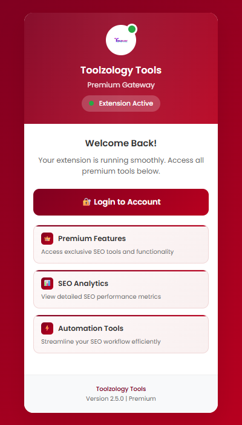

# Toolzology Chrome Extension

  
  
  

---

## Project Showcase

Official **Manifest V3** Chrome extension for [toolzology.com](https://toolzology.com) — secure browser tooling with service worker background scripts, content scripts, and a polished popup UI.

## Repository

[github.com/mafzalkalwardev/toolzology-chrome-extension](https://github.com/mafzalkalwardev/toolzology-chrome-extension)

## Screenshots

| Extension Popup |
|---|
|  |

## Key Features

- Manifest V3 service worker architecture
- Content scripts for toolzology.com integration
- Popup UI with modern gradient design
- Storage, notifications, and declarative net request support

## Install (Developer Mode)

1. Clone this repository
2. Open `chrome://extensions`
3. Enable **Developer mode**
4. Click **Load unpacked** and select this folder

## About the Developer

**Muhammad Afzal Kalwar** — [@mafzalkalwardev](https://github.com/mafzalkalwardev) · [mafzalkalwardev.github.io](https://mafzalkalwardev.github.io)

SEO Keywords

Muhammad Afzal Kalwar, mafzalkalwardev, Chrome extension MV3, browser tools, JavaScript extension developer Pakistan

---

Built by Muhammad Afzal Kalwar · FT Solutions

